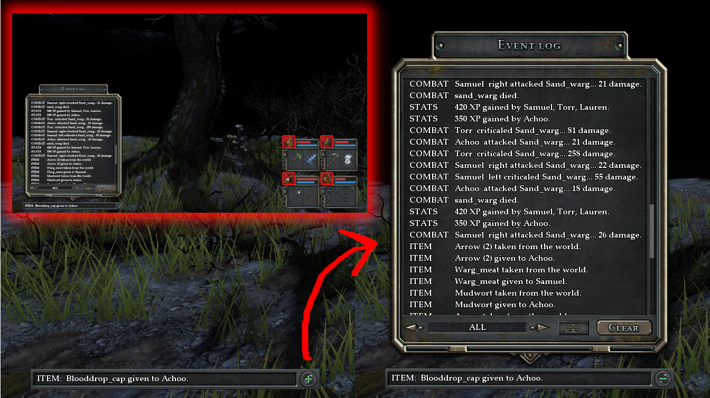

# Legend of Grimrock 2 - my work

"Legend of Grimrock 2" umods and dungeon assets I'm making publically available.

- [umods/eventLog.lua](https://github.com/jon-heard/Grimrock-2-work/blob/main/umods/eventLog.lua) - This mod adds an in-game event log GUI to allow review of all in-game events.

    

- [umods/moreMapMarkers.lua](https://github.com/jon-heard/Grimrock-2-work/blob/main/umods/moreMapMarkers.lua) - This mod adds 8 more icons to select from when marking up a dungeon map.

    
